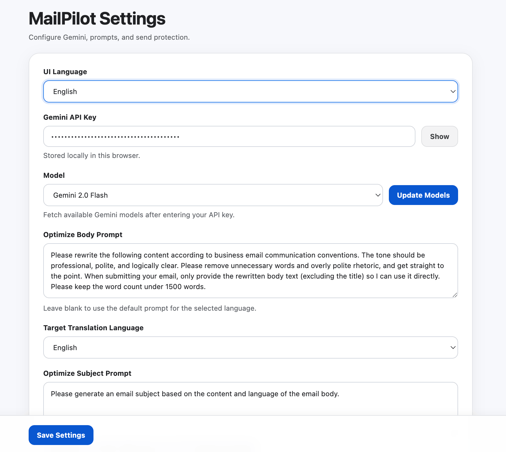
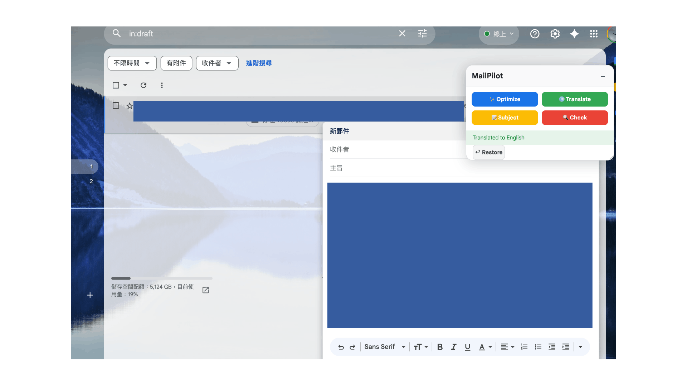

[English](README.md) | [繁體中文](README.zh-TW.md)

  

<h1 align="center">MailPilot AI</h1>

**MailPilot AI** is a premium Chrome Extension that transforms your Gmail experience with the power of Google's Gemini AI. It's not just another AI tool; it's a seamless companion that lives directly within your Gmail compose window to help you write better, faster, and more safely.

---

## ✨ Key Features

### 🚀 Smart Writing Suite
*   **Email Optimization**: Instantly rewrite drafts into professional, polished, and concise business communications.
*   **Subject Generation**: Let AI craft the perfect subject line based on your email's context.
*   **One-Click Translation**: Seamlessly translate your drafts into major world languages (English, Chinese, Japanese, etc.) without leaving Gmail.
*   **Custom Email Review**: Use your own AI prompts to check for tone, clarity, or potential risks before hitting send.

### 🛡️ Safety & Productivity
*   **Send Guard (Safety First)**: A double-click confirmation mechanism that prevents accidental "Send" mistakes. If enabled, you have 5 seconds to confirm your decision.
*   **Smart Auto-Hide**: The AI panel intelligently appears when you're composing and disappears when you're done, keeping your interface clean.
*   **Backup & Restore**: Every AI optimization creates a temporary backup. Not happy with the result? Revert to your original text with one click.

### 🌐 Global & Modern Design
*   **Multi-language Support**: Full UI localization for **English**, **Traditional Chinese (繁體中文)**, and **Simplified Chinese (简体中文)**.
*   **Premium UI/UX**: A modern, draggable, and resizable interface designed with glassmorphism aesthetics to match your professional workflow.

---

## 🛠️ Technical Stack

*   **Manifest V3**: Built on the latest Chrome Extension standards for security and performance.
*   **Google Gemini API**: Powered by `gemini-1.5-flash` (or your choice of models) for state-of-the-art natural language processing.
*   **Vanilla JS & CSS**: Lightweight and fast, with zero external dependencies to ensure maximum compatibility.

---

## 🚀 Getting Started

### 1. Installation
1.  Clone this repository or download the source code.
2.  Open Chrome and navigate to `chrome://extensions/`.
3.  Enable **Developer mode** (top right).
4.  Click **Load unpacked** and select the project folder.

### 2. Configuration
1.  Click the MailPilot icon in your browser toolbar or go to the extension options.
2.  Enter your **Gemini API Key** (Get one for free at [Google AI Studio](https://aistudio.google.com/)).
3.  Click **Update Models** to fetch and select your preferred AI model.
4.  Customize your **Optimize Prompts** or leave them blank to use the high-quality defaults.

---

## 📸 Interface Preview

  
   <em>Sleek floating panel integrated into Gmail's UI</em>

  
   <em>Professional options page with real-time sync</em>

---

## 📜 License

Distributed under the MIT License. See `LICENSE` for more information.

---

**MailPilot AI** — *Write with confidence, send with peace of mind.*
